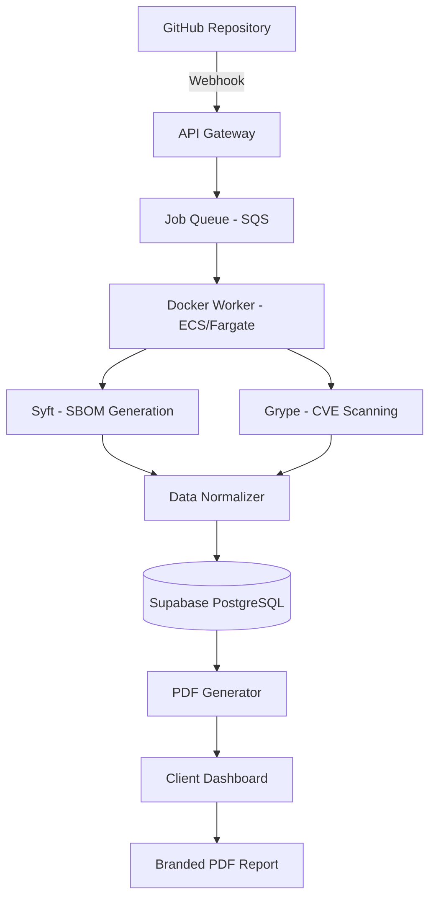
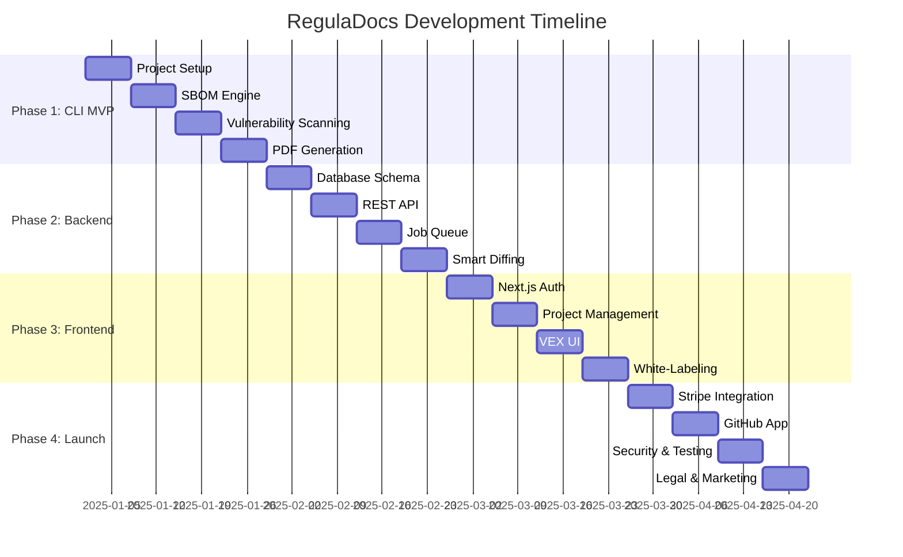

# RegulaDocs Development Plan

> **Practical roadmap to build an automated CRA compliance & SBOM generator from MVP to production SaaS.**

---

## 📋 Executive Summary

**Objective:** Build RegulaDocs as a compliance automation platform that converts code dependencies into EU Cyber Resilience Act (CRA) compliant documentation.

**Timeline:** 16 weeks (4 months) from MVP to market-ready SaaS  
**Target Market:** EU software agencies (10-50 employees) at €149/month  
**Core Value:** Reduce 2-day manual compliance work to 5 minutes

---

## 🎯 Success Metrics

| Metric             | Target                          | Timeline |
| ------------------ | ------------------------------- | -------- |
| **MVP Completion** | Working CLI + PDF output        | Week 4   |
| **First 10 Users** | Beta testers from cold outreach | Week 8   |
| **€1,000 MRR**     | 7 paying agencies               | Week 12  |
| **€10,000 ARR**    | 60+ paying customers            | Week 16+ |

---

## 🏗️ Architecture Overview



Architecture Diagram Code:



**Key Components:**

- **Frontend:** Next.js + Tailwind CSS (Dashboard)
- **Backend:** Node.js/TypeScript (API + Workers)
- **Scanners:** Syft (SBOM) + Grype (vulnerabilities)
- **Database:** Supabase (PostgreSQL with real-time)
- **Queue:** AWS SQS (async job processing)
- **Compute:** AWS ECS Fargate (containerized workers)
- **Storage:** AWS S3 (PDF archives)

---

## 📅 Phase-by-Phase Implementation

### **Phase 1: Foundation & Local CLI (Weeks 1-4)**

> **Goal:** Build a working local CLI that scans code and outputs JSON reports.

#### **Week 1: Project Setup & Core Infrastructure**

**Tasks:**

- [ ] Initialize Node.js/TypeScript project with modern tooling
  - ESLint, Prettier, Husky for git hooks
  - Jest for testing framework
  - tsconfig strict mode enabled
- [ ] Set up monorepo structure (optional: use Turborepo/Nx)

```

/packages
/cli - Local scanning tool
/core - Shared business logic
/api - Backend API (future)
/web - Next.js dashboard (future)

```

- [ ] Install and configure Syft + Grype
- Docker-based approach (bundled container) OR
- Local binaries with PATH detection
- [ ] Create `.vex-config.json` schema validation (Zod/JSON Schema)

**Deliverables:**

- Working dev environment with TypeScript compilation
- Documented setup instructions in README
- Basic CLI skeleton (`reguladocs --version` works)

---

#### **Week 2: SBOM Generation Engine**

**Tasks:**

- [ ] Implement `SyftRunner` class
- Execute `syft <directory> -o json`
- Parse SPDX/CycloneDX output formats
- Error handling for unsupported projects
- [ ] Build language detection logic
- Auto-detect package managers (package.json, go.mod, Cargo.toml, pom.xml, requirements.txt)
- Support for multiple languages in monorepos
- [ ] Create data models for SBOM components

```typescript
interface Component {
  name: string;
  version: string;
  purl: string; // Package URL
  licenses: string[];
  type: "library" | "application" | "framework";
  isDev: boolean; // devDependency flag
}
```

- [ ] Write unit tests for SBOM parsing

**Deliverables:**

- CLI command: `reguladocs scan . --output sbom.json`
- Sample SBOM output for test projects (Node.js, Go, Python)

---

#### **Week 3: Vulnerability Scanning & VEX Implementation**

**Tasks:**

- [ ] Implement `GrypeRunner` class
  - Execute `grype sbom:./sbom.json -o json`
  - Parse vulnerability matches
  - Map CVE data to components
- [ ] Build VEX (Vulnerability Exploitability eXchange) logic
  - Load `.vex-config.json` ignore rules
  - Filter vulnerabilities based on user decisions
  - Create audit trail structure
  ```json
  {
    "cve": "CVE-2023-1234",
    "status": "not_affected",
    "justification": "Function not used",
    "approved_by": "Andreas A.",
    "date": "2025-05-20"
  }
  ```
- [ ] Implement severity scoring (CVSS → Traffic Light)
  - **Red:** CVSS 9.0-10.0 (Critical)
  - **Orange:** CVSS 7.0-8.9 (High)
  - **Yellow:** CVSS 4.0-6.9 (Medium)
  - **Green:** CVSS 0.0-3.9 (Low)
- [ ] Filter devDependencies by default

**Deliverables:**

- CLI command: `reguladocs scan . --config .vex-config.json`
- JSON output with categorized vulnerabilities

---

#### **Week 4: PDF Report Generation (MVP "Aha!" Moment)**

**Tasks:**

- [ ] Choose PDF engine: **pdfmake** (JSON-based) OR **Puppeteer** (HTML→PDF)
  - Recommendation: pdfmake for templates, Puppeteer for complex layouts
- [ ] Design PDF structure:
  1. **Cover Page** (Project name, agency branding, date)
  2. **Executive Summary** (Traffic light dashboard)
  3. **SBOM Table** (All components with licenses)
  4. **Vulnerability Report** (Grouped by severity)
  5. **VEX Audit Trail** (Ignored vulnerabilities with justifications)
  6. **Appendix** (Methodology, tool versions)
- [ ] Implement templating system
  - Support for white-labeling (logo upload)
  - Configurable branding colors
- [ ] Generate sample PDFs for 3 real-world projects

**Deliverables:**

- CLI command: `reguladocs scan . --output report.pdf`
- Branded PDF that looks professional enough to show clients
- **Internal demo:** Show to 3 agency owners for feedback

---

### **Phase 2: SaaS Backend & Database (Weeks 5-8)**

> **Goal:** Build the API and database to move from local CLI to cloud-based continuous monitoring.

#### **Week 5: Database Schema Design**

**Tasks:**

- [ ] Set up Supabase project (PostgreSQL + Auth)
- [ ] Design relational schema:

  ```sql
  -- Core entities
  users (id, email, agency_name, plan_tier, created_at)
  projects (id, user_id, name, repo_url, last_scan_at)
  scans (id, project_id, status, started_at, completed_at)
  components (id, scan_id, name, version, purl, licenses, is_dev)
  vulnerabilities (id, component_id, cve_id, severity, cvss_score)
  vex_decisions (id, user_id, cve_id, package, status, justification, approved_by, approved_at)

  -- Audit trail
  scan_history (id, scan_id, previous_scan_id, new_vulns_count, fixed_vulns_count)
  ```

- [ ] Create migrations (use Supabase migrations or Prisma)
- [ ] Implement Row-Level Security (RLS) policies
  - Users can only access their own projects
- [ ] Seed database with test data

**Deliverables:**

- Database schema documented in `docs/Database-Schema.md`
- Working migrations

---

#### **Week 6: REST API & Authentication**

**Tasks:**

- [ ] Build Express.js/Fastify API with TypeScript
- [ ] Implement user authentication
  - Supabase Auth (email/password + GitHub OAuth)
  - JWT token validation middleware
- [ ] Create API endpoints:
  ```
  POST   /api/projects              - Create new project
  GET    /api/projects              - List user's projects
  POST   /api/projects/:id/scan     - Trigger manual scan
  GET    /api/scans/:id             - Get scan results
  POST   /api/vex-decisions         - Save VEX ignore rule
  GET    /api/reports/:scan_id/pdf  - Download PDF
  ```
- [ ] Input validation (Zod schemas)
- [ ] Error handling middleware (standardized JSON errors)
- [ ] Rate limiting (express-rate-limit)

**Deliverables:**

- Documented API with OpenAPI/Swagger spec
- Postman collection for testing

---

#### **Week 7: Background Job Queue & Docker Workers**

**Tasks:**

- [ ] Set up AWS SQS queue (or BullMQ with Redis for simpler start)
- [ ] Create Docker container for scanner workers
  ```dockerfile
  FROM node:18-alpine
  RUN apk add --no-cache curl git
  RUN curl -sSfL https://raw.githubusercontent.com/anchore/syft/main/install.sh | sh
  RUN curl -sSfL https://raw.githubusercontent.com/anchore/grype/main/install.sh | sh
  COPY . /app
  CMD ["node", "worker.js"]
  ```
- [ ] Implement worker logic:
  1. Poll SQS for scan jobs
  2. Clone target repository (with GitHub token)
  3. Run Syft + Grype in isolated directory
  4. Parse and normalize results
  5. Insert data into Supabase
  6. Update scan status
  7. Trigger PDF generation
  8. Send notification email
- [ ] Deploy worker to AWS ECS Fargate (or Docker on VPS for MVP)
- [ ] Implement job retry logic (3 attempts with exponential backoff)

**Deliverables:**

- Working async scan pipeline
- Average scan time < 5 minutes for medium projects

---

#### **Week 8: Smart Diffing & Change Detection**

**Tasks:**

- [ ] Implement scan comparison algorithm
  - **New vulnerabilities:** CVE in current scan but not in previous
  - **Fixed vulnerabilities:** CVE in previous scan but not in current
  - **Changed dependencies:** Version updates
- [ ] Build notification system
  - Email alerts for new critical CVEs (SendGrid/AWS SES)
  - Slack webhook integration (optional)
- [ ] Create "Baseline" feature
  - Allow users to mark current state as "Accepted Risk"
  - Only alert on delta changes
- [ ] Add database queries for historical analysis
  ```sql
  -- Example: Get new vulnerabilities since last scan
  SELECT v.*
  FROM vulnerabilities v
  WHERE v.scan_id = :current_scan_id
  AND v.cve_id NOT IN (
    SELECT cve_id FROM vulnerabilities
    WHERE scan_id = :previous_scan_id
  )
  ```

**Deliverables:**

- Email notification: "3 new critical vulnerabilities found in Project X"
- Dashboard shows "diff view" between scans

---

### **Phase 3: Frontend Dashboard (Weeks 9-12)**

> **Goal:** Build the customer-facing web app where agencies manage projects and download reports.

#### **Week 9: Next.js Setup & Authentication**

**Tasks:**

- [ ] Initialize Next.js 14 with App Router
  - TypeScript + Tailwind CSS
  - ESLint configured
- [ ] Implement authentication pages
  - `/login` - Email/password + GitHub OAuth button
  - `/signup` - Registration with email verification
  - Protected routes with middleware
- [ ] Create layout system
  - Sidebar navigation (Projects, Scans, Settings)
  - Top bar (user menu, notifications)
- [ ] Integrate Supabase client SDK
  - Real-time subscriptions for scan status updates

**Deliverables:**

- Working authentication flow
- Responsive layout (mobile-friendly)

---

#### **Week 10: Project Management UI**

**Tasks:**

- [ ] Build Projects dashboard (`/dashboard/projects`)
  - Table view with: Name, Last Scan, Status, Vulnerabilities Count
  - "Add New Project" modal
    - Manual repo URL input OR
    - GitHub App integration (select from user's repos)
- [ ] Implement Project Detail page (`/dashboard/projects/:id`)
  - Overview stats: Total components, High/Medium/Low vulns
  - Traffic light summary dashboard
  - Scan history timeline
- [ ] Create "Trigger Scan" button
  - Calls `/api/projects/:id/scan`
  - Shows loading state with real-time progress
  - Uses Supabase real-time for status updates

**Deliverables:**

- Users can add projects and trigger scans from UI

---

#### **Week 11: Vulnerability Management & VEX UI**

**Tasks:**

- [ ] Build Vulnerability explorer (`/dashboard/projects/:id/vulnerabilities`)
  - Filterable table: Severity, Package, CVE ID, Status
  - Search functionality
- [ ] Create "Ignore CVE" modal
  - Dropdown for status: `not_affected`, `false_positive`, `accepted_risk`
  - Text area for justification (required)
  - Input for approver name
  - Preview of audit trail entry
- [ ] Implement VEX decision management
  - View all ignore rules (`/dashboard/vex-decisions`)
  - Edit/Delete existing decisions
  - Show which scans they apply to
- [ ] Build SBOM viewer
  - Searchable component list
  - License compliance view (flag GPL if needed)

**Deliverables:**

- Non-technical users can manage false positives without touching JSON files

---

#### **Week 12: Report Generation & White-Labeling**

**Tasks:**

- [ ] Build PDF generation endpoint in API
  - Accepts scan ID + branding config
  - Renders PDF using data from database
  - Stores in S3 with expiring pre-signed URL
- [ ] Create Settings page (`/dashboard/settings`)
  - **Branding Tab:**
    - Upload agency logo (Next.js Image with S3 upload)
    - Select brand colors (color picker)
    - Preview PDF template
  - **Billing Tab:**
    - Current plan display (€29 Starter / €149 Agency)
    - Usage stats (scans this month, storage used)
    - Stripe Customer Portal link (future)
- [ ] Implement "Download Report" button
  - Generates PDF with current white-label settings
  - Download or email to client option
- [ ] Add report archive (`/dashboard/reports`)
  - List of all generated PDFs with download links
  - 12-month retention policy

**Deliverables:**

- End-to-end flow: Scan → Review → Customize → Download branded PDF
- **Internal milestone:** Show demo to beta testers

---

### **Phase 4: Polish & Launch (Weeks 13-16)**

> **Goal:** Prepare for public launch with billing, legal compliance, and marketing assets.

#### **Week 13: Payment Integration & Subscription Logic**

**Tasks:**

- [ ] Integrate Stripe
  - Create products: Starter (€29), Agency (€149), Enterprise (custom)
  - Set up webhook endpoint (`/api/webhooks/stripe`)
  - Handle events: `customer.subscription.created`, `invoice.payment_succeeded`, `subscription.deleted`
- [ ] Implement subscription gates
  - Starter: Max 3 projects
  - Agency: Unlimited projects (soft cap at 50)
  - Check limits before allowing new scans
- [ ] Build billing portal
  - Use Stripe Customer Portal for upgrades/cancellations
  - Display next billing date and invoice history
- [ ] Add usage tracking
  - Count scans per month
  - Storage used (PDF + SBOM files in S3)

**Deliverables:**

- Users can subscribe and pay via Stripe
- Subscription status reflected in UI permissions

---

#### **Week 14: GitHub App Integration**

**Tasks:**

- [ ] Create GitHub App
  - Permissions: Read access to code, metadata, and webhooks
  - Subscribe to `push` events
- [ ] Implement OAuth flow for installation
  - Users authorize app to access their repos
  - Store installation token in database
- [ ] Build automatic scanning trigger
  - Webhook listener (`/api/webhooks/github`)
  - On push to default branch → Queue scan job
  - Configurable: Scan on every push OR weekly schedule
- [ ] Add GitHub Action (optional)
  ```yaml
  # .github/workflows/reguladocs.yml
  name: CRA Compliance Scan
  on: [push]
  jobs:
    scan:
      runs-on: ubuntu-latest
      steps:
        - uses: reguladocs/scan-action@v1
          with:
            api-key: ${{ secrets.REGULADOCS_API_KEY }}
  ```

**Deliverables:**

- Continuous monitoring: Scans run automatically on code changes
- Listed in GitHub Marketplace (future growth channel)

---

#### **Week 15: Security, Performance & Testing**

**Tasks:**

- [ ] Security hardening
  - Run `npm audit` and fix vulnerabilities
  - Implement CSRF protection (Next.js middleware)
  - Add Content Security Policy headers
  - Enable HTTPS everywhere (AWS ALB + ACM certificate)
  - Secrets management (AWS Secrets Manager for API keys)
- [ ] Performance optimization
  - Database indexing (PostgreSQL EXPLAIN analysis)
  - Frontend: Next.js Image optimization, code splitting
  - CDN for static assets (CloudFront)
  - Lazy loading for large tables
- [ ] Comprehensive testing
  - Unit tests: 80%+ coverage for core logic
  - Integration tests: API endpoints with test database
  - E2E tests: Playwright for critical flows (signup → scan → download PDF)
- [ ] Load testing
  - Simulate 100 concurrent scans (Artillery.io)
  - Ensure workers auto-scale in ECS

**Deliverables:**

- Passing CI/CD pipeline (GitHub Actions)
- Performance benchmarks documented

---

#### **Week 16: Legal Compliance & Go-Live Preparation**

**Tasks:**

- [ ] Legal documentation
  - **Terms of Service** (explicitly state no legal advice)
  - **Privacy Policy** (GDPR-compliant data handling)
  - **GDPR compliance:**
    - Data export feature (user can download all their data)
    - Data deletion (GDPR "right to be forgotten")
    - Cookie consent banner (if using analytics)
  - Add disclaimer to footer:
    > "RegulaDocs provides technical documentation based on automated analysis. We do not provide legal advice. Compliance with the Cyber Resilience Act remains the responsibility of the operator."
- [ ] Marketing assets
  - Landing page (`https://reguladocs.com`)
    - Hero: "Turn Code into CRA Compliance in 5 Minutes"
    - Social proof: Logos of beta testers (with permission)
    - Video demo (Loom recording)
  - SEO content
    - Blog post: "EU Cyber Resilience Act: Complete Guide for Software Agencies"
    - CRA Checklist PDF (lead magnet)
  - LinkedIn outreach script
- [ ] Monitoring & observability
  - Set up Sentry for error tracking
  - CloudWatch dashboards for API latency, worker queue depth
  - Uptime monitoring (UptimeRobot)
- [ ] Create onboarding flow
  - Welcome email sequence (Day 0, 3, 7)
  - In-app tutorial tooltips (first project setup)

**Deliverables:**

- Production-ready application
- **Launch:** Announce on LinkedIn, HackerNews, r/entrepreneur

---

## 🛡️ Risk Mitigation

### **Technical Risks**

| Risk                            | Impact | Mitigation                                             |
| ------------------------------- | ------ | ------------------------------------------------------ |
| **Syft/Grype breaking changes** | High   | Pin versions in Docker, monitor release notes          |
| **GitHub rate limits**          | Medium | Use GitHub App tokens (5000 req/hr), implement caching |
| **Scan timeouts (large repos)** | High   | Set 15-min timeout, incremental scanning (future)      |
| **PDF generation memory leaks** | Medium | Isolated workers, restart after 50 jobs                |

### **Business Risks**

| Risk                               | Impact   | Mitigation                                                                    |
| ---------------------------------- | -------- | ----------------------------------------------------------------------------- |
| **GitHub releases free SBOM tool** | Critical | Focus on VEX management + white-labeling (impossible for GitHub to replicate) |
| **CRA deadline pushed to 2027**    | High     | Pivot messaging to "supply chain security" (evergreen need)                   |
| **Low sales conversion**           | Medium   | Offer free tier (3 repos forever) to build user base                          |

---

## 💰 Cost Structure (Monthly)

| Item                 | Cost (EUR)   | Notes                              |
| -------------------- | ------------ | ---------------------------------- |
| **AWS ECS Fargate**  | €50-200      | Scales with scan volume            |
| **Supabase Pro**     | €25          | 8GB database, 50GB bandwidth       |
| **AWS S3**           | €10          | PDF storage                        |
| **AWS SES (Email)**  | €5           | Transactional emails               |
| **Stripe**           | 2.9% + €0.25 | Per transaction                    |
| **Domain + Hosting** | €10          | Vercel free tier + domain          |
| **Total (Base)**     | **€100-250** | Break-even at 2 Agency subs (€298) |

---

## 📊 Success Timeline



---

## 🎓 Learning Resources

### **Compliance & Standards**

- [ ] Read EU CRA full text: [eur-lex.europa.eu](https://eur-lex.europa.eu/)
- [ ] Study SBOM formats: [SPDX](https://spdx.dev/), [CycloneDX](https://cyclonedx.org/)
- [ ] Understand VEX: [CISA VEX Guide](https://www.cisa.gov/sbom)

### **Tools Documentation**

- [ ] Syft: [github.com/anchore/syft](https://github.com/anchore/syft)
- [ ] Grype: [github.com/anchore/grype](https://github.com/anchore/grype)
- [ ] Supabase: [supabase.com/docs](https://supabase.com/docs)

---

## ✅ Definition of Done (MVP Checklist)

### **Must Have (MVP Launch Criteria)**

- [ ] User can sign up and authenticate
- [ ] User can add a GitHub repository
- [ ] System scans repo and detects vulnerabilities
- [ ] User can mark CVEs as "ignored" with justification
- [ ] System generates a branded PDF report
- [ ] PDF includes: Cover, SBOM, Vulnerabilities, VEX audit trail
- [ ] User can upload agency logo for white-labeling
- [ ] Stripe subscription working (€149 Agency tier)
- [ ] Automatic weekly scans via GitHub webhook
- [ ] Email notifications for new critical CVEs
- [ ] Terms of Service + Privacy Policy live

### **Should Have (Week 17-20)**

- [ ] GitHub Marketplace listing
- [ ] API documentation site (Docusaurus)
- [ ] Slack integration for alerts
- [ ] Multi-language support (German UI)

### **Could Have (Future)**

- [ ] License compliance checking (GPL detection)
- [ ] JIRA/Linear integration (auto-create tickets for CVEs)
- [ ] Custom report templates (enterprise feature)
- [ ] On-premise Docker container (self-hosted)

---

## 📞 Next Immediate Actions

### **Week 0 (Pre-Development)**

1. **Validate Market (3 days)**

   - [ ] LinkedIn outreach to 50 agencies
   - [ ] Offer free manual audit of their public repo
   - [ ] Gauge interest in automation tool

2. **Set Up Infrastructure (2 days)**

   - [ ] Register domain: `reguladocs.com`
   - [ ] Create AWS account + enable billing alerts
   - [ ] Set up Supabase project
   - [ ] Create GitHub organization

3. **Legal Foundation (2 days)**
   - [ ] Consult with IT lawyer (1-hour session, ~€200)
   - [ ] Draft initial Terms of Service
   - [ ] Set up business entity (if not already) - Sole proprietorship vs GmbH

**Decision Point:** If 10+ agencies express interest → Green light to build.

---

## 🚀 Launch Strategy (Week 16+)

### **Day 1: Soft Launch**

- Email 50 agencies from validation phase
- Post on LinkedIn with demo video
- Submit to r/SideProject (Reddit)

### **Week 1: Content Blitz**

- Publish: "How We Built a CRA Compliance Tool in 16 Weeks"
- Guest post on DEV.to / Medium
- Email law firms specializing in IT compliance

### **Month 2: Partnerships**

- Partner with boutique IT law firms (referral program)
- List on GitHub Marketplace
- Create Zapier integration (connect to 5000+ apps)

### **Month 3: Scale**

- Hire freelance sales VA for outbound
- Run LinkedIn ads (€500 budget test)
- Attend EU software agency conferences

---

## 📈 Growth Projections (Conservative)

| Milestone                  | Timeline | MRR    | Customers   |
| -------------------------- | -------- | ------ | ----------- |
| **MVP Launch**             | Month 4  | €0     | 0           |
| **First Paying Customers** | Month 5  | €447   | 3 agencies  |
| **Break-Even**             | Month 6  | €1,341 | 9 agencies  |
| **Ramen Profitable**       | Month 9  | €2,980 | 20 agencies |
| **Full-Time Viable**       | Month 12 | €7,450 | 50 agencies |

**Key Assumption:** 10% conversion from free tier to paid (industry standard for SaaS).

---

## 🏁 Final Thoughts

This plan is **deliberately aggressive but realistic**. Many SaaS businesses take 12-24 months to launch. We aim for 4 months because:

1. **Legislative Deadline:** The CRA creates urgency.
2. **Existing Tools:** Syft/Grype handle the hard parts.
3. **Niche Focus:** Not competing with Snyk/Sonatype on depth, but on documentation workflow.

**The "Build vs. Buy" Test:** If you can build a feature in 2 weeks OR buy it for €100/month, build it (you're pre-revenue). After €5k MRR, prioritize customer feedback over roadmap.

**Founder Bandwidth:** This assumes 40 hours/week dedicated. If part-time, double all timelines.

---

**Questions? Refer to:**

- [MVP.md](./MVP.md) - Product vision
- [MVP-Technical.md](./MVP-Technical.md) - Technical architecture
- [Execution-Playbook.md](./Execution-Playbook.md) - Business model

**Built with discipline and urgency. Let's execute. 🚀**
