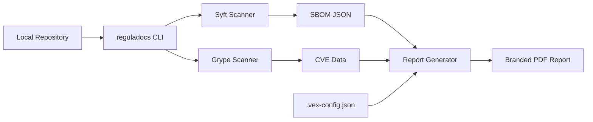
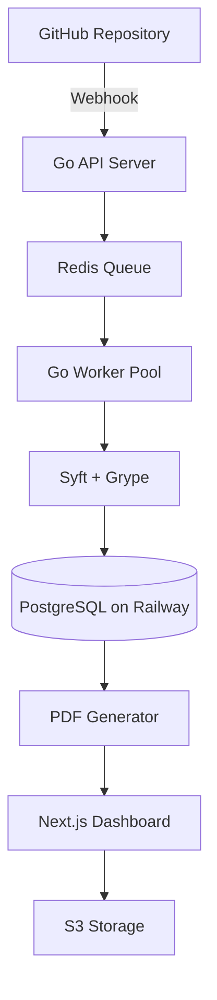

# RegulaDocs Development Plan

> **Practical roadmap to build an automated CRA compliance & SBOM generator - CLI-first approach.**

---

## 📋 Executive Summary

**Objective:** Build RegulaDocs as a compliance automation CLI tool that converts code dependencies into EU Cyber Resilience Act (CRA) compliant documentation.

**Strategy:** CLI-First → License Revenue → SaaS (if demand exists)  
**Timeline:** 8 weeks to first revenue, 16 weeks to SaaS (optional)  
**Target Market:** EU software agencies (10-50 employees)  
**Core Value:** Reduce 2-day manual compliance work to 5 minutes

---

## 🎯 Success Metrics

| Metric                    | Target                                        | Timeline |
| ------------------------- | --------------------------------------------- | -------- |
| **CLI MVP**               | Working binary + PDF output                   | Week 4   |
| **First 10 Beta Users**   | Free testing with agencies                    | Week 6   |
| **First Paying Customer** | €49 license sale                              | Week 8   |
| **€1,000 Revenue**        | ~20 license sales OR 6 pro licenses           | Week 12  |
| **SaaS Decision Point**   | Build web version if 50+ customers request it | Week 16  |

---

## 🏗️ Architecture Overview

### **Phase 1: CLI Tool (Weeks 1-8)**



**Key Components:**

- **CLI Binary:** Go (single executable, 10-15MB)
- **Scanners:** Syft (SBOM) + Grype (vulnerabilities)
- **PDF Engine:** chromedp (headless Chrome) OR wkhtmltopdf
- **Storage:** Local filesystem only (no cloud dependency)
- **Monetization:** License key system (validate against public API)

### **Phase 2: SaaS (Weeks 9-16, OPTIONAL)**

Only build if CLI customers are actively requesting continuous monitoring.



**Additional Components (if SaaS):**

- **Backend:** Go API with Fiber/Echo framework
- **Database:** PostgreSQL on Railway ($5/month)
- **Queue:** Redis + worker pool
- **Frontend:** Next.js + Tailwind CSS
- **Auth:** Custom JWT (no Supabase)

---

## 📅 Phase-by-Phase Implementation

### **Phase 1: CLI MVP (Weeks 1-8)**

> **Goal:** Ship a paid CLI tool that generates compliance PDFs locally.

#### **Week 1: Go Project Setup & Core Infrastructure**

**Tasks:**

- [ ] Initialize Go project structure
  ```bash
  reguladocs/
  ├── cmd/reguladocs/        # Main CLI entry point
  ├── internal/
  │   ├── scanner/           # Syft/Grype wrappers
  │   ├── parser/            # JSON parsing logic
  │   ├── reporter/          # PDF generation
  │   ├── vex/               # VEX config handling
  │   └── license/           # License validation
  ├── pkg/
  │   └── models/            # Shared data structures
  ├── testdata/              # Sample repos for testing
  └── go.mod
  ```
- [ ] Set up Go tooling
  - golangci-lint for code quality
  - goreleaser for multi-platform builds
  - GitHub Actions CI pipeline
- [ ] Install Syft + Grype
  - Test local execution: `syft . -o json`
  - Test vulnerability scan: `grype sbom.json -o json`
- [ ] Create CLI skeleton with Cobra
  ```bash
  reguladocs --version
  reguladocs scan --help
  ```

**Deliverables:**

- Working Go project with CI/CD
- CLI compiles and runs on macOS/Linux/Windows
- Basic command structure implemented

---

#### **Week 2: SBOM Generation Engine**

**Tasks:**

- [ ] Implement `scanner.RunSyft()` function
  - Execute Syft as subprocess
  - Parse SPDX/CycloneDX JSON output
  - Error handling for unsupported projects
- [ ] Build package manager detection
  - Auto-detect: package.json, go.mod, Cargo.toml, pom.xml, requirements.txt, composer.json
  - Support monorepos (multiple package managers in subdirectories)
- [ ] Create data models

  ```go
  type Component struct {
      Name      string   `json:"name"`
      Version   string   `json:"version"`
      PURL      string   `json:"purl"`
      Licenses  []string `json:"licenses"`
      Type      string   `json:"type"` // library, framework, application
      IsDev     bool     `json:"is_dev"`
  }

  type SBOM struct {
      ProjectName string      `json:"project_name"`
      Components  []Component `json:"components"`
      GeneratedAt time.Time   `json:"generated_at"`
      ToolVersion string      `json:"tool_version"`
  }
  ```

- [ ] Filter devDependencies by default
- [ ] Write unit tests with sample projects

**Deliverables:**

- CLI command: `reguladocs scan . --output sbom.json`
- Tested with 5 different language ecosystems
- JSON output validates against SPDX schema

---

#### **Week 3: Vulnerability Scanning & VEX Implementation**

**Tasks:**

- [ ] Implement `scanner.RunGrype()` function
  - Execute Grype with SBOM input
  - Parse CVE matches from JSON
  - Map vulnerabilities to components
- [ ] Build VEX config loader
  - Parse `.vex-config.json` file (create JSON schema)
  - Validate ignore rules structure
  ```json
  {
    "project_name": "My Client App",
    "agency_name": "CodeWorks GmbH",
    "ignore_rules": [
      {
        "cve": "CVE-2023-1234",
        "package": "lodash",
        "status": "not_affected",
        "justification": "Function not used",
        "approved_by": "Andreas A.",
        "date": "2025-05-20"
      }
    ]
  }
  ```
- [ ] Implement severity classification
  - Critical: CVSS 9.0-10.0 (Red)
  - High: CVSS 7.0-8.9 (Orange)
  - Medium: CVSS 4.0-6.9 (Yellow)
  - Low: CVSS 0.0-3.9 (Green)
- [ ] Apply VEX filters to vulnerability list
- [ ] Add `--include-dev` flag to optionally show devDependencies

**Deliverables:**

- CLI command: `reguladocs scan . --config .vex-config.json --output vulnerabilities.json`
- Vulnerability JSON with applied filters
- Example .vex-config.json template

---

#### **Week 4: PDF Report Generation (THE PRODUCT)**

**Tasks:**

- [ ] Choose PDF engine: chromedp (recommended) or wkhtmltopdf
  - chromedp: HTML → headless Chrome → PDF (modern, clean output)
  - Embeds Chrome in Go binary (adds 100MB but zero dependencies)
- [ ] Design HTML template for PDF
  1. **Cover Page**
     - Project name
     - Agency logo placeholder
     - Report date
     - "Generated by RegulaDocs"
  2. **Executive Summary**
     - Traffic light dashboard (colored boxes)
     - Total components count
     - Critical/High/Medium/Low vulnerability counts
     - License risk summary
  3. **Table of Contents**
  4. **SBOM Table**
     - Sortable by name, version, license
     - Flag GPL/AGPL licenses in red
  5. **Vulnerability Report**
     - Grouped by severity
     - CVE ID, package, description, CVSS score
     - Remediation advice (upgrade to version X)
  6. **VEX Audit Trail**
     - List of ignored CVEs with justifications
     - Approval signatures
  7. **Appendix**
     - Methodology description
     - Syft/Grype versions used
     - Scan timestamp
- [ ] Implement Go HTML template rendering
- [ ] Add CSS styling (Bootstrap or Tailwind CDN for quick styling)
- [ ] Generate sample PDFs for 3 real projects

**Deliverables:**

- CLI command: `reguladocs scan . --output report.pdf`
- **CRITICAL:** PDF must look professional enough to email to clients
- **Internal demo:** Show to 5 agency owners and collect feedback

---

#### **Week 5-6: White-Labeling & License System**

**Tasks:**

- [ ] Implement white-label configuration
  - Create `~/.reguladocs/config.yaml` for user settings
  ```yaml
  agency_name: "CodeWorks GmbH"
  agency_logo: "/path/to/logo.png"
  brand_color: "#1E3A8A"
  license_key: "REGULA-XXXX-XXXX-XXXX"
  ```
- [ ] Build logo processor
  - Accept PNG/JPG/SVG
  - Resize to fit cover page (max 200x100px)
  - Embed in PDF template
- [ ] Create license key system
  - License format: `REGULA-XXXX-XXXX-XXXX` (16 chars)
  - On first run, prompt user to enter key
  - Validate against simple public API endpoint
  ```go
  // Call https://api.reguladocs.com/v1/license/validate
  // Returns: { "valid": true, "tier": "pro", "expires": "2025-12-31" }
  ```
- [ ] Implement tier-based features
  - **Free tier:** Basic PDF (with "Powered by RegulaDocs" watermark)
  - **Pro tier (€49):** Remove watermark, add logo, custom brand colors
  - **Agency tier (€149):** Unlimited scans, priority support
- [ ] Add `reguladocs init` command
  - Interactive setup wizard
  - Asks for: Agency name, logo path, license key
  - Saves to config file

**Deliverables:**

- White-labeled PDFs with custom branding
- License validation working
- Config command: `reguladocs config --set agency_name="My Agency"`

---

#### **Week 7: CLI Polish & Testing**

**Tasks:**

- [ ] Add progress indicators
  - Spinner during Syft scan (can take 30-60 seconds)
  - Progress bar for large repos
  ```
  Scanning repository... ⠋
  ✓ Found 1,247 packages
  Analyzing vulnerabilities... ⠴
  ✓ Identified 12 vulnerabilities (3 critical, 9 high)
  Generating PDF... ⠙
  ✓ Report saved to compliance-report.pdf
  ```
- [ ] Implement caching
  - Cache SBOM results in `.reguladocs/cache/`
  - Skip re-scan if package files unchanged
  - `--force` flag to bypass cache
- [ ] Add helpful error messages
  - "Syft not found. Install with: curl -sSfL ... | sh"
  - "License key invalid. Visit https://reguladocs.com/pricing"
- [ ] Build auto-updater
  - Check GitHub releases for new version
  - `reguladocs update` command
- [ ] Create comprehensive README
  - Installation instructions
  - Quick start guide
  - CLI reference documentation
- [ ] Cross-platform testing
  - Test on macOS, Linux (Ubuntu), Windows
  - Fix any path/shell issues

**Deliverables:**

- Polished CLI with excellent UX
- Help documentation (`reguladocs --help` is comprehensive)
- Bug-free on all 3 major platforms

---

#### **Week 8: Launch Preparation & First Sales**

**Tasks:**

- [ ] Create landing page (simple one-pager)
  - Hero: "CRA Compliance in 5 Minutes"
  - Demo video (2 minutes, show: install → scan → PDF)
  - Pricing table: Free vs Pro (€49) vs Agency (€149)
  - Stripe Checkout links
- [ ] Set up payment processing
  - Stripe Products for each tier
  - Webhook to email license key after payment
  - Auto-generate license keys (store in PostgreSQL on Railway)
- [ ] Write sales email template

  ```
  Subject: Free CRA Compliance Audit for [Agency Name]

  Hi [Name],

  I noticed you're building software for EU clients. With the Cyber
  Resilience Act coming into force, agencies need automated SBOM
  documentation.

  I built a tool that generates CRA-compliant PDFs in 5 minutes.

  Want a free audit of one of your projects? No sales call required.

  - Andreas
  ```

- [ ] LinkedIn outreach to 50 agencies
  - Offer free manual audit
  - Send them a branded PDF of their project
  - If they like it, pitch the CLI tool
- [ ] Create GitHub Releases
  - Pre-built binaries for macOS/Linux/Windows
  - Release notes
  - Installation instructions

**Deliverables:**

- Public website live at reguladocs.com
- First 3 license sales (target: €150 revenue)
- 10 beta users actively testing

---

### **Phase 2: SaaS Backend (Weeks 9-16, OPTIONAL)**

> **Goal:** Only build this if CLI customers are requesting continuous monitoring.

**Decision Criteria:**

- 50+ CLI users asking: "Can this run automatically on every commit?"
- OR: 10+ agencies willing to prepay €500 for SaaS version

#### **Week 9-10: Go API Server & Database**

**Tasks:**

- [ ] Set up Railway project (PostgreSQL + deployment)
- [ ] Design database schema (simplified)
  ```sql
  users (id, email, license_key, created_at)
  projects (id, user_id, name, repo_url, last_scan_at)
  scans (id, project_id, status, scan_data_json, created_at)
  vex_decisions (id, user_id, cve_id, package, status, justification)
  ```
- [ ] Build Go API with Fiber framework
  - `POST /api/auth/register` - Create account
  - `POST /api/auth/login` - JWT authentication
  - `POST /api/projects` - Add repository
  - `POST /api/projects/:id/scan` - Trigger scan (queues job)
  - `GET /api/scans/:id` - Get scan results
  - `GET /api/reports/:id/pdf` - Download PDF
- [ ] Implement custom JWT auth (no Supabase)
- [ ] Deploy API to Railway

---

#### **Week 11-12: Background Workers & GitHub Integration**

**Tasks:**

- [ ] Set up Redis for job queue
- [ ] Build worker pool in Go
  - Poll Redis for scan jobs
  - Clone repo to temp directory
  - Run Syft + Grype (reuse CLI code)
  - Store results in PostgreSQL
  - Generate PDF and upload to S3
  - Clean up temp files
- [ ] Create GitHub App
  - Webhook listener for `push` events
  - OAuth flow for repository access
  - Auto-queue scans on code changes
- [ ] Implement rate limiting (max 10 scans/hour per user)

---

#### **Week 13-14: Next.js Dashboard**

**Tasks:**

- [ ] Build Next.js app with Tailwind CSS
- [ ] Authentication pages (login/signup)
- [ ] Projects dashboard
  - List repositories
  - Trigger manual scans
  - View scan history
- [ ] Vulnerability viewer with filters
- [ ] VEX management UI
- [ ] Settings page (branding, billing)

---

#### **Week 15-16: Stripe Subscriptions & Launch**

**Tasks:**

- [ ] Migrate license system to Stripe subscriptions
  - Starter: €29/month (3 repos)
  - Agency: €149/month (unlimited repos)
- [ ] Add email notifications for new CVEs
- [ ] Security hardening (HTTPS, CORS, rate limiting)
- [ ] Launch marketing campaign
  - Blog post: "From CLI to SaaS in 8 Weeks"
  - GitHub Marketplace listing
  - LinkedIn ads (€500 budget)

---

## 🛡️ Risk Mitigation

### **Technical Risks**

| Risk                                  | Impact   | Mitigation                                                  |
| ------------------------------------- | -------- | ----------------------------------------------------------- |
| **PDF quality looks amateur**         | Critical | Hire designer for €200 to create HTML template              |
| **Syft/Grype binary not found**       | High     | Bundle binaries in Docker image, auto-download on first run |
| **Cross-platform compilation issues** | Medium   | Use goreleaser, test on all platforms in CI                 |
| **License key piracy**                | Medium   | Online validation required, rate-limited API calls          |

### **Business Risks**

| Risk                               | Impact   | Mitigation                                      |
| ---------------------------------- | -------- | ----------------------------------------------- |
| **No one pays €49**                | Critical | Fall back to usage-based pricing (€5/report)    |
| **GitHub releases free SBOM tool** | High     | Double down on white-labeling + VEX audit trail |
| **CRA deadline extended**          | Medium   | Pivot to "supply chain security" messaging      |

---

## 💰 Cost Structure

### **CLI-Only Phase (Weeks 1-8)**

- **Total cost:** €50/month
  - Railway (API for license validation): €5/month
  - Domain (reguladocs.com): €10/year
  - Email (SendGrid free tier): €0
  - S3 for user logos: €5/month
  - **Break-even:** 2 Pro licenses/month

### **SaaS Phase (Weeks 9-16)**

- **Total cost:** €80/month
  - Railway (PostgreSQL + API): €15/month
  - Redis Cloud: €10/month
  - S3 (PDF storage): €10/month
  - Email (SendGrid): €5/month
  - Domain + Vercel: €10/month
  - **Break-even:** 1 Agency subscription (€149)

---

## 📊 Revenue Projections (CLI-First Model)

| Month       | Licenses Sold          | Revenue | MRR  | Notes         |
| ----------- | ---------------------- | ------- | ---- | ------------- |
| **Month 1** | 0                      | €0      | €0   | Building      |
| **Month 2** | 5 (Pro)                | €245    | €0   | Beta sales    |
| **Month 3** | 10 (Pro) + 2 (Agency)  | €788    | €100 | Word of mouth |
| **Month 4** | 15 (Pro) + 5 (Agency)  | €1,480  | €300 | LinkedIn ads  |
| **Month 6** | 30 (Pro) + 10 (Agency) | €2,960  | €800 | Break-even    |

**Key Assumption:** 20% month-over-month growth from referrals.

---

## ✅ Definition of Done (CLI MVP)

### **Must Have (Week 8 Launch)**

- [ ] CLI installs with one command
- [ ] Scan detects packages for Node.js, Go, Python, Rust, Java
- [ ] Vulnerabilities shown with traffic light severity
- [ ] PDF looks professional (hireable designer if needed)
- [ ] White-labeling works (logo + brand color)
- [ ] License key validation works
- [ ] Landing page with Stripe checkout
- [ ] 5 real agencies tested and provided feedback

### **Should Have (Week 9-12)**

- [ ] GitHub Releases automation
- [ ] Homebrew tap (`brew install reguladocs`)
- [ ] Windows installer (.exe)
- [ ] CLI analytics (anonymous usage stats)

### **Could Have (Future)**

- [ ] License compliance warnings (GPL detection)
- [ ] Custom report templates (JSON → PDF)
- [ ] JIRA/Linear integration
- [ ] VS Code extension

---

## 📞 Next Immediate Actions

### **This Week (Week 0)**

1. **Validate Demand (2 days)**

   - [ ] LinkedIn outreach to 30 agencies
   - [ ] Manually generate 3 SBOM reports
   - [ ] Email them: "I can automate this. Would you pay €49?"

2. **Set Up Dev Environment (1 day)**

   - [ ] Install Go 1.21+
   - [ ] Install Syft: `curl -sSfL https://raw.githubusercontent.com/anchore/syft/main/install.sh | sh`
   - [ ] Install Grype: `curl -sSfL https://raw.githubusercontent.com/anchore/grype/main/install.sh | sh`
   - [ ] Test on sample project

3. **Register Business Assets (1 day)**
   - [ ] Buy domain: reguladocs.com (~€10)
   - [ ] Create Stripe account
   - [ ] Set up Railway account

**Decision Point:** If 5+ agencies say "yes, I'd pay" → Start building on Monday.

---

## 🚀 Launch Strategy

### **Week 8: CLI Launch**

- Email 50 agencies: "Free beta access + 50% off first license"
- Post on HackerNews (Show HN: CRA compliance in 5 minutes)
- LinkedIn post with demo video

### **Month 3: Partnership Push**

- Contact 10 IT law firms in Germany
- Offer 20% revenue share for referrals
- Create "Compliance Partner" badge for their website

### **Month 6: Content Marketing**

- Blog series: "CRA Compliance for Software Agencies"
- Guest post on DEV.to
- Podcast appearances (Indie Hackers, Syntax.fm)

---

## 🏁 Final Thoughts

This plan prioritizes **revenue over perfection**. Here's why CLI-first wins:

1. **No hosting costs** - Users run it locally
2. **Faster to ship** - 4-8 weeks vs 16 weeks for SaaS
3. **Prove demand** - If no one pays €49, don't build SaaS
4. **Simpler support** - No database, no auth, no scaling issues

**The "2-Week Rule":** If you can ship something valuable in 2 weeks that customers will pay for, do it. Don't build the "perfect" SaaS if a CLI solves 80% of the problem.

**Validation Metric:** Get 10 paying customers for the CLI before writing a single line of SaaS code.

---

**Questions? Refer to:**

- [MVP.md](./MVP.md) - Product vision
- [MVP-Technical.md](./MVP-Technical.md) - Technical architecture
- [Execution-Playbook.md](./Execution-Playbook.md) - Business model

**Ship fast, validate hard, scale smart. 🚀**
